<div align="center">

# EduRisk AI

### Explainable Machine Learning for Academic Risk Prediction

[](https://www.python.org/)
[](https://scikit-learn.org/)
[](https://xgboost.readthedocs.io/)
[](https://shap.readthedocs.io/)
[](https://fastapi.tiangolo.com/)
[](https://nextjs.org/)
[](LICENSE)
[](#testing)

<br>

**EduRisk AI predicts which university students are at academic risk — and explains exactly why.**

[Quick Start](#quick-start) • [Architecture](#architecture) • [Screenshots](#screenshots) • [Results](#results) • [API](#rest-api)

</div>

---

### Pipeline Overview

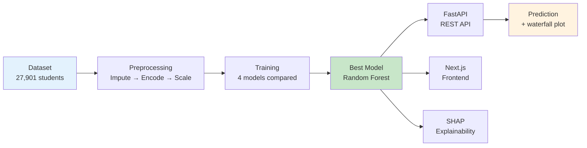

---

## Why This Project?

Most ML repositories stop at training a model. EduRisk AI goes further — it demonstrates the **full machine learning lifecycle** as it works in production:

| Stage | What EduRisk AI Does |
|-------|---------------------|
| **Data** | 27,901 student records, 11 selected features, 3-class risk target |
| **Preprocessing** | Leakage-free pipeline — scaler fit on train only |
| **Training** | 4 models compared with GridSearchCV + Optuna Bayesian tuning |
| **Evaluation** | Accuracy, ROC-AUC, per-class metrics, error analysis, calibration |
| **Explainability** | SHAP TreeExplainer — global importance + per-prediction waterfall |
| **Serving** | FastAPI REST API + Next.js frontend + Gradio dashboard |
| **Testing** | 62 unit tests across all modules |
| **Deployment** | Docker containerization, CI/CD with GitHub Actions |

---

## Tech Stack

| Layer | Technologies |
|-------|-------------|
| **Frontend** | Next.js, TypeScript, Tailwind CSS, Framer Motion |
| **API** | FastAPI, Uvicorn, Pydantic validation |
| **ML** | Scikit-learn, XGBoost, SHAP, Optuna |
| **Data** | Pandas, NumPy, Kaggle API |
| **DevOps** | Docker, GitHub Actions, Pytest |

---

## Quick Start

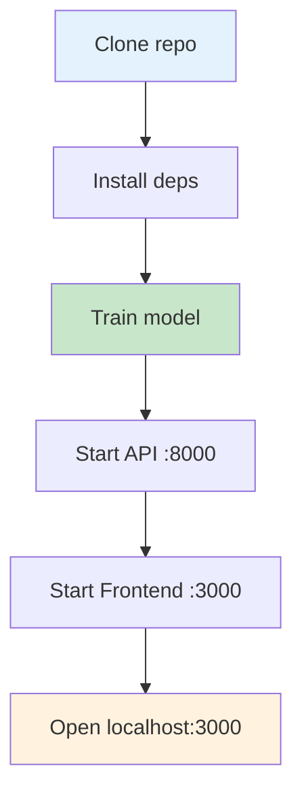

```bash
# Clone
git clone https://github.com/Khizar525/edurisk-ai.git
cd edurisk-ai

# Setup
python -m venv venv
venv\Scripts\activate      # Windows
pip install -r requirements.txt

# Train
python -m src.training.trainer

# Launch API
uvicorn app.api:app --host 0.0.0.0 --port 8000

# Launch Frontend
cd frontend && npm install && npm run dev
```

> Gradio is also available via `python -m app.main` as a lightweight alternative.

---

## Architecture

EduRisk AI separates training, inference, and presentation into independent layers — the same prediction engine serves the REST API, the Next.js frontend, and the Gradio dashboard.

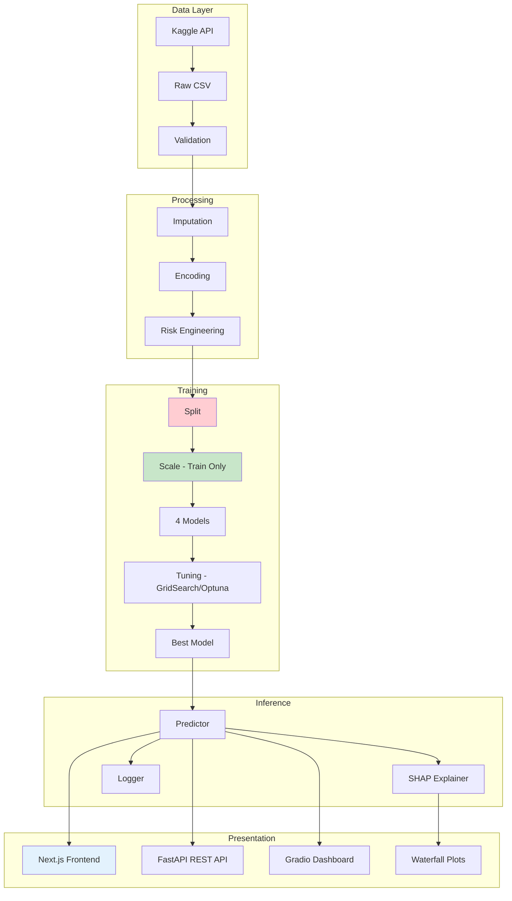

### Data Flow (No Data Leakage)

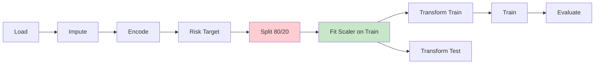

> **Leakage safety**: Imputation (median/mode) and label encoding happen before the split. This is safe — median/mode are robust statistics that don't leak target information, and label encoding is a deterministic mapping (Male→0, Female→1). The scaler is the only transformer fitted after the split, on training data only.

---

## Screenshots

<div align="center">

**Dashboard — Dark Mode UI**

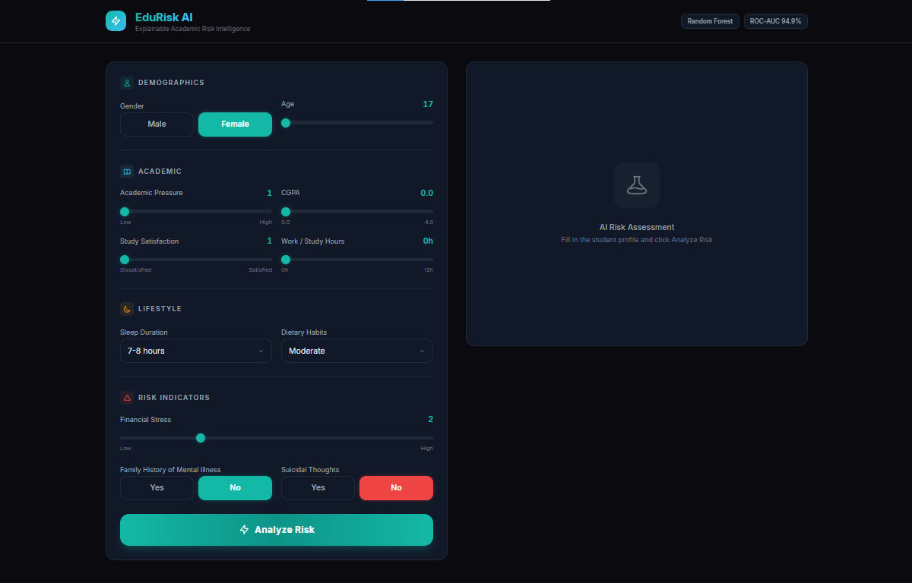

</div>

<div align="center">

**Prediction with SHAP Explainability**

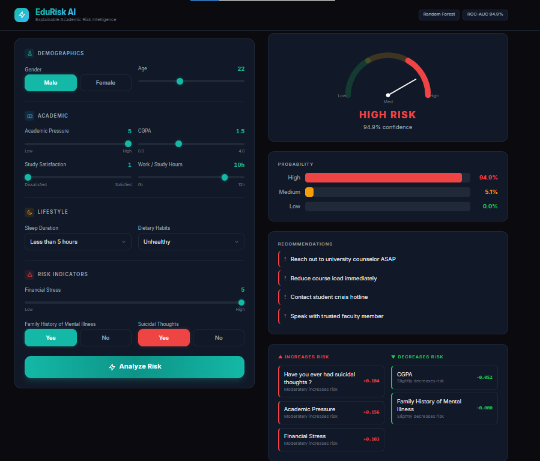

</div>

<div align="center">

**SHAP Feature Contributions**

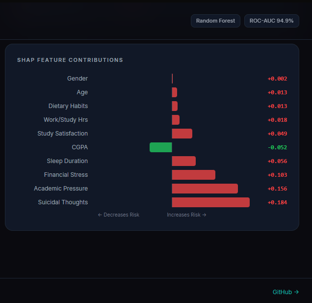

</div>

<div align="center">

**REST API — Swagger Documentation**

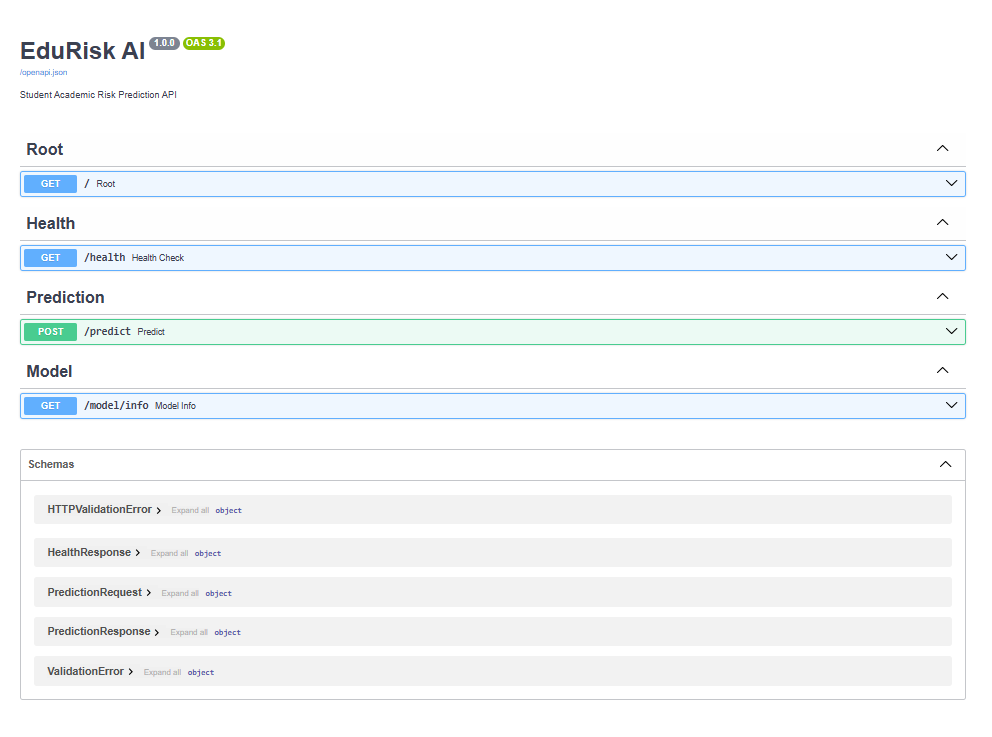

</div>

---

## Results

> **Best Model — Random Forest**
>
> Accuracy: **85.58%** · ROC-AUC: **94.92%** · CV: **85.27 ± 0.39%**

Although XGBoost achieved a slightly higher ROC-AUC (95.02%), Random Forest was selected for deployment because it provided the best balance between accuracy, calibration, inference speed, and SHAP interpretability. TreeExplainer on Random Forest produces exact, consistent feature attributions — critical for a system that must explain its predictions to non-technical stakeholders.

| Model | Accuracy | ROC-AUC | 3-Fold CV |
|-------|----------|---------|-----------|
| **Random Forest** | **85.58%** | **94.92%** | **85.27 ± 0.39%** |
| XGBoost | 85.24% | 95.02% | 85.88 ± 0.27% |
| MLP | 85.18% | 94.69% | 84.66 ± 0.46% |
| SVM | 82.12% | 93.10% | 82.40 ± 0.19% |

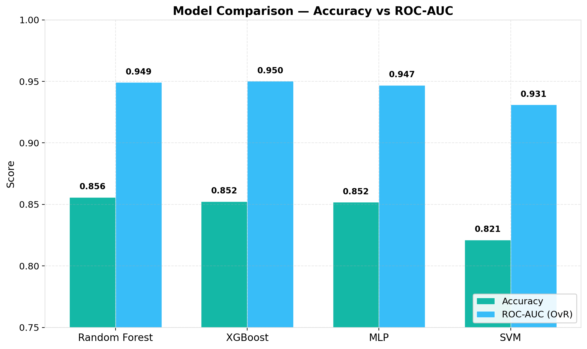

### Per-Class Performance (Random Forest)

| Class | Precision | Recall | F1-Score |
|-------|-----------|--------|----------|
| Low Risk | 0.87 | 0.88 | 0.88 |
| Medium Risk | 0.70 | 0.59 | 0.64 |
| High Risk | 0.91 | 0.97 | 0.94 |

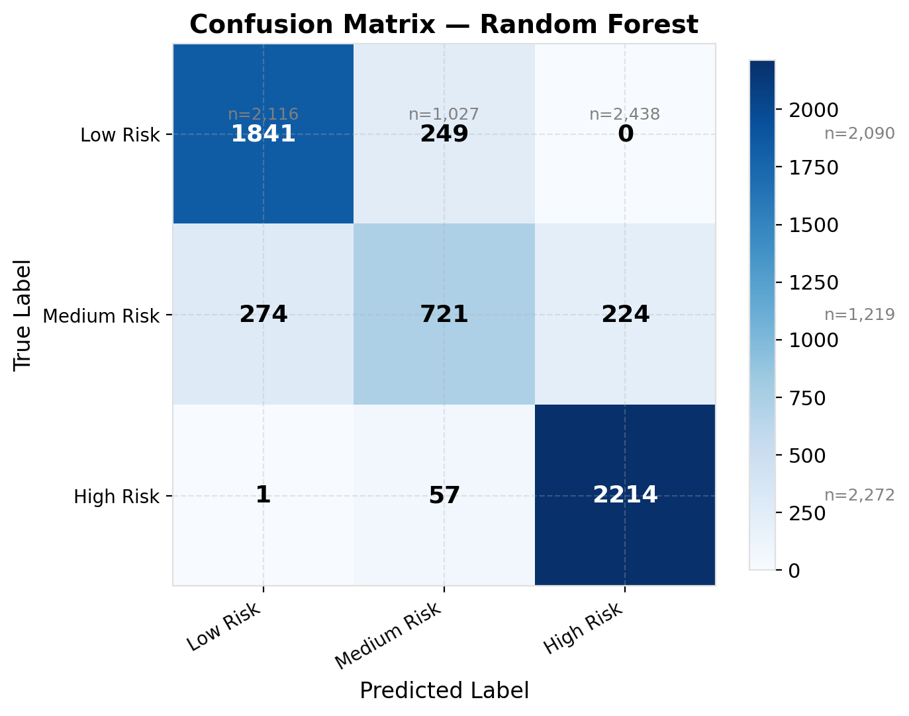
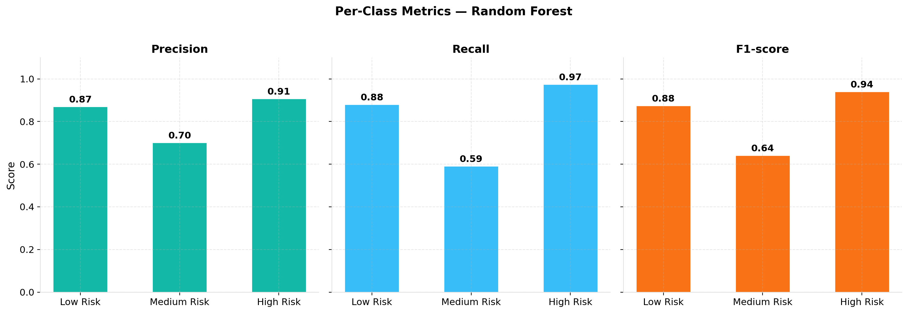

> See [docs/results.md](docs/results.md) for detailed analysis. See [MODEL_CARD.md](MODEL_CARD.md) for model documentation.

---

## REST API

The FastAPI backend exposes three endpoints:

| Method | Endpoint | Description |
|--------|----------|-------------|
| `POST` | `/predict` | Risk prediction with SHAP explanation |
| `GET` | `/health` | Model health check |
| `GET` | `/model/info` | Model metadata and feature names |

### Example Request

```bash
curl -X POST http://localhost:8000/predict \
  -H "Content-Type: application/json" \
  -d '{
    "gender": "Male",
    "age": 22,
    "academic_pressure": 5,
    "cgpa": 1.5,
    "study_satisfaction": 1,
    "sleep_duration": "Less than 5 hours",
    "dietary_habits": "Unhealthy",
    "work_study_hours": 10,
    "financial_stress": 5,
    "family_history": "Yes",
    "suicidal_thoughts": "Yes"
  }'
```

### Example Response

```json
{
  "prediction": 2,
  "risk_level": "High Risk",
  "predicted_probability": "94.9%",
  "shap": {
    "top_risk": [{"feature": "Suicidal Thoughts", "impact": 0.332}],
    "top_protective": [{"feature": "CGPA", "impact": -0.112}]
  }
}
```

Interactive docs at `http://localhost:8000/docs`.

---

## Repository Structure

```
edurisk-ai/
├── app/                    # Application layer
│   ├── main.py             # Gradio dashboard
│   └── api.py              # FastAPI REST API
├── frontend/               # Next.js + Tailwind frontend
│   └── src/components/     # 6 React components
├── src/                    # Core ML library
│   ├── config.py           # Centralized configuration
│   ├── data/               # Data loading and validation
│   ├── preprocessing/      # Imputation, encoding, scaling
│   ├── features/           # Risk engineering
│   ├── training/           # Model training and tuning
│   ├── evaluation/         # Metrics, plots, error analysis
│   ├── explainability/     # SHAP utilities
│   ├── inference/          # Prediction service and logging
│   └── utils/              # Validators and helpers
├── tests/                  # 62 unit tests
├── docs/                   # Documentation
├── assets/                 # Charts, screenshots, figures
├── models/                 # Saved model artifacts
├── data/                   # Raw and processed data
└── docker/                 # Containerization
```

---

## Dataset

**Student Depression Dataset** — [Kaggle](https://www.kaggle.com/datasets/hopesb/student-depression-dataset)

| Property | Value |
|----------|-------|
| Records | 27,901 |
| Features Used | 11 (selected from 27) |
| Target | 3-class Risk Level (Low / Medium / High) |

### Limitations

- **Self-reported data** — features rely on student self-assessment
- **Survey bias** — collected via online surveys
- **Demographic limitations** — may not generalize across all populations
- **Temporal snapshot** — single point in time, not longitudinal

---

## Design Decisions

### Why Random Forest over XGBoost?

XGBoost had slightly higher ROC-AUC (95.02% vs 94.92%), but Random Forest was selected because: (1) higher overall accuracy (85.58% vs 85.24%), (2) better calibration, (3) faster inference, and (4) TreeExplainer produces exact, consistent SHAP attributions.

### Why SHAP over LIME?

SHAP provides both global feature importance and per-prediction explanations with mathematical guarantees (Shapley values). TreeExplainer on tree models gives exact attributions in polynomial time.

### Why FastAPI alongside Gradio?

FastAPI provides automatic OpenAPI documentation, native async support, and Pydantic validation. Gradio serves as a rapid prototyping interface for demos.

---

## Testing

```bash
python -m pytest tests/ -v
```

**62 tests** covering preprocessing, training, evaluation, SHAP, inference, and API.

---

## Documentation

- [Architecture Guide](docs/architecture.md) — system design with Mermaid diagrams
- [ML Methodology](docs/methodology.md) — pipeline, feature selection, model details
- [Results & Metrics](docs/results.md) — performance analysis and error patterns
- [Case Study](docs/case-study.md) — full engineering narrative
- [Model Card](MODEL_CARD.md) — model details, fairness, and usage
- [Contributing Guide](CONTRIBUTING.md) — how to contribute

<details>
<summary>Additional Resources</summary>

- [Interview Prep](docs/interview-prep.md) — 30 Q&As for technical interviews
- [Portfolio Material](docs/portfolio.md) — resume bullets, pitches, descriptions
- [LinkedIn Launch Kit](docs/linkedin.md) — posts, carousel, article outline
- [Brand Guide](docs/brand.md) — visual identity, color palette, typography
- [Visual Assets](docs/assets.md) — screenshots, charts, diagrams catalog
- [Social Preview](docs/social-preview.md) — GitHub banner and OG image setup
- [Final Review](docs/final-review.md) — scoring and recommendations

</details>

---

## Roadmap

- [x] Multi-model training with hyperparameter tuning
- [x] SHAP explainability with waterfall plots
- [x] FastAPI REST API with Swagger documentation
- [x] Next.js dark-mode frontend with animated visualizations
- [x] Docker containerization
- [x] CI/CD with GitHub Actions
- [ ] MLflow experiment tracking
- [ ] Cloud deployment (Vercel + Render)
- [ ] Continuous model monitoring

---

## License

This project is licensed under the MIT License — see the [LICENSE](LICENSE) file for details.

---

## Acknowledgements

- **Dataset**: [Student Depression Dataset](https://www.kaggle.com/datasets/hopesb/student-depression-dataset) on Kaggle
- **Course**: CSL 460 — Data Mining, Bahria University Karachi Campus
- **Instructors**: Dr. Hussain (Course), Engr. Noor us Sabah (Lab)

---

<div align="center">

### Developed by

**M. Khizar Akram** — Team Lead

Architecture · FastAPI · Next.js · CI/CD · Deployment

<br>

### Contributors

| Name | Contribution |
|------|-------------|
| M. Khizar Akram | End-to-end system, REST API, frontend, Docker, documentation |
| Safwan Marwat | Data collection, Kaggle integration, exploratory analysis |
| Syed Mughees | Preprocessing pipeline, feature engineering, label encoding |
| Ifrahim Yousuf | Model training, hyperparameter tuning, evaluation metrics |

[](https://github.com/Khizar525)

</div>
