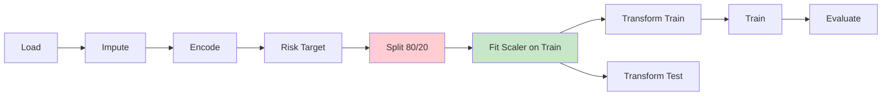
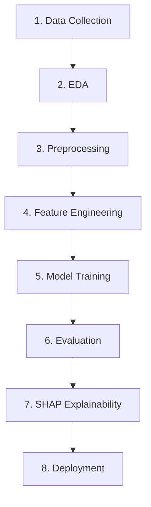

<div align="center">

# EduRisk AI

### Predicting Academic Risk Before It Becomes a Crisis

[](https://www.python.org/)
[](https://scikit-learn.org/)
[](https://xgboost.readthedocs.io/)
[](https://shap.readthedocs.io/)
[](https://optuna.org/)
[](https://www.gradio.app/)
[](LICENSE)
[](#testing)

<br>

An end-to-end machine learning system that predicts the **academic risk level** (Low / Medium / High) of university students using self-reported lifestyle, psychological, and academic indicators — with **SHAP explainability**, a **Next.js + Tailwind frontend**, and a **FastAPI REST API**.

[Quick Start](#-quick-start) • [Architecture](#-architecture) • [Screenshots](#-screenshots) • [Results](#-results) • [Deployment](#-deployment) • [Documentation](#-documentation)

</div>

---

## Overview

Every year, universities lose students to academic failure and mental health crises that could have been intercepted earlier. **EduRisk AI** uses machine learning to predict which students are at high academic risk based on survey data — and explains exactly why.

The system compares **four classifiers** — Random Forest, SVM, XGBoost, and MLP — with hyperparameter tuning (GridSearchCV or Optuna), cross-validation, and SHAP-based explainability. A Gradio web interface provides real-time risk assessment with per-prediction feature contribution analysis.

### Key Features

| Feature | Description |
|---------|-------------|
| **Multi-Model Comparison** | Random Forest, SVM (RBF), XGBoost, MLP |
| **Hyperparameter Tuning** | GridSearchCV (default) or Optuna (Bayesian) |
| **SHAP Explainability** | Global feature importance + per-prediction waterfall plots |
| **Risk Engineering** | Composite scoring → 3-class academic risk levels |
| **Live Dashboard** | Modern Gradio UI with risk gauge, probability charts, analytics |
| **Next.js Frontend** | Professional dark-mode UI with Tailwind CSS + Framer Motion |
| **REST API** | FastAPI service with /predict, /health, /model/info endpoints |
| **Prediction Logging** | Timestamped CSV with analytics and export |
| **Error Analysis** | Misclassification patterns and feature comparison |
| **Reproducible Pipeline** | No data leakage, fixed random seeds, saved artifacts |
| **62 Unit Tests** | Comprehensive test coverage across all modules |

---

## Quick Start

```bash
# Clone the repository
git clone https://github.com/Khizar525/edurisk-ai.git
cd edurisk-ai

# Create virtual environment
python -m venv venv
venv\Scripts\activate      # Windows
# source venv/bin/activate  # macOS/Linux

# Install dependencies
pip install -r requirements.txt

# Run the application
python -m app.main
```

The Gradio dashboard will launch at `http://localhost:7860` with a public shareable link.

### Train Models

```bash
# Train all models and save best
python -m src.training.trainer
```

---

## Architecture

```mermaid
graph TB
    subgraph "Data Layer"
        A[Kaggle API] --> B[Raw CSV]
        B --> C[Validation]
    end

    subgraph "Processing"
        C --> D[Imputation]
        D --> E[Encoding]
        E --> F[Risk Engineering]
    end

    subgraph "Training"
        F --> G[Split]
        G --> H[Scale - Train Only]
        H --> I[4 Models]
        I --> J[Tuning - GridSearch/Optuna]
        J --> K[Best Model]
    end

    subgraph "Inference"
        K --> L[Predictor]
        L --> M[SHAP Explainer]
        L --> N[Logger]
    end

    subgraph "UI"
        L --> O[Gradio Dashboard]
        M --> P[Waterfall Plots]
        M --> Q[Interpretation]
        O --> R[Tabs: Predict | Analytics | About]
    end

    style G fill:#ffcdd2
    style H fill:#c8e6c9
    style O fill:#fff3e0
```

### Data Flow (No Leakage)



### Repository Structure

```
edurisk-ai/
├── app/                    # Gradio application + FastAPI
│   ├── main.py             # Gradio UI layout
│   └── api.py              # FastAPI REST API
├── frontend/               # Next.js + Tailwind frontend
│   ├── src/app/page.tsx    # Main page component
│   └── src/components/     # UI components (Gauge, SHAP, etc.)
├── src/                    # Core ML package
│   ├── config.py           # Central configuration
│   ├── data/               # Data loading and validation
│   ├── preprocessing/      # Cleaning, encoding, scaling
│   ├── features/           # Feature engineering
│   ├── training/           # Model training and tuning
│   ├── evaluation/         # Metrics, plots, error analysis
│   ├── explainability/     # SHAP utilities
│   ├── inference/          # Prediction service and logging
│   └── utils/              # Shared utilities
├── tests/                  # 62 unit tests
├── notebooks/              # Jupyter notebooks
├── docs/                   # Documentation (Mermaid diagrams)
├── assets/                 # Charts, screenshots, model figures
├── models/                 # Saved model artifacts
├── data/                   # Raw and processed data
└── docker/                 # Containerization
```

---

## Screenshots

### Dashboard — Empty State


### Prediction — High Risk Result


### SHAP Feature Contributions


### FastAPI Swagger UI


---

## Dataset

**Student Depression Dataset** — [Kaggle](https://www.kaggle.com/datasets/hopesb/student-depression-dataset)

| Property | Value |
|----------|-------|
| Records | ~27,000 |
| Features | 27 (11 selected for modeling) |
| Target | 3-class Risk Level (Low / Medium / High) |
| Source | Student self-report survey |

### Selected Features

| Feature | Type | Description |
|---------|------|-------------|
| Gender | Categorical | Student gender |
| Age | Numerical | Student age |
| Academic Pressure | Ordinal (1-5) | Self-reported academic pressure |
| CGPA | Numerical | Cumulative GPA |
| Study Satisfaction | Ordinal (1-5) | Satisfaction with study conditions |
| Sleep Duration | Categorical | Daily sleep hours |
| Dietary Habits | Categorical | General diet quality |
| Work/Study Hours | Numerical | Daily study/work hours |
| Financial Stress | Ordinal (1-5) | Self-reported financial stress |
| Family History | Categorical | Family history of mental illness |
| Suicidal Thoughts | Categorical | History of suicidal ideation |

---

## Methodology

### Pipeline



### Models

| Model | Type | Tuning | SHAP |
|-------|------|--------|------|
| Random Forest | Ensemble (bagging) | GridSearchCV / Optuna | TreeExplainer |
| SVM (RBF) | Kernel method | GridSearchCV / Optuna | KernelExplainer |
| XGBoost | Ensemble (boosting) | GridSearchCV / Optuna | TreeExplainer |
| MLP | Neural network | GridSearchCV / Optuna | KernelExplainer |

### Evaluation

- **Metrics**: Accuracy, ROC-AUC (OvR), 5-fold CV, Precision, Recall, F1
- **Visualizations**: Confusion matrices, ROC curves, PR curves, calibration plots, learning curves, radar charts
- **Error Analysis**: Misclassification patterns, feature comparison, confusion pairs

---

## Results

| Model | Accuracy | ROC-AUC | 3-Fold CV |
|-------|----------|---------|-----------|
| **Random Forest** | **85.58%** | **94.92%** | 85.27 ± 0.39% |
| XGBoost | 85.24% | 95.02% | 85.88 ± 0.27% |
| MLP | 85.18% | 94.69% | 84.66 ± 0.46% |
| SVM | 82.12% | 93.10% | 82.40 ± 0.19% |

**Best Model:** Random Forest — 85.58% accuracy, 94.92% ROC-AUC


### Per-Class Performance (Random Forest)

| Class | Precision | Recall | F1-Score |
|-------|-----------|--------|----------|
| Low Risk | 0.87 | 0.88 | 0.88 |
| Medium Risk | 0.70 | 0.59 | 0.64 |
| High Risk | 0.91 | 0.97 | 0.94 |


> See [docs/results.md](docs/results.md) for detailed analysis and visualizations.
> See [MODEL_CARD.md](MODEL_CARD.md) for model documentation.

---

## Deployment

### Local — Next.js Frontend (Recommended)

```bash
cd frontend
npm install
npm run dev
# Frontend: http://localhost:3000
```

### Local — FastAPI REST API

```bash
uvicorn app.api:app --host 0.0.0.0 --port 8000
# API docs: http://localhost:8000/docs
```

### Local — Gradio Dashboard

```bash
python -m app.main
```

### Docker

```bash
cd docker
docker-compose up --build
```

### Gradio Share

The app supports `share=True` for temporary public URLs via ngrok.

---

## Testing

```bash
# Run all tests
python -m pytest tests/ -v

# Run with coverage
python -m pytest tests/ -v --cov=src --cov-report=html
```

**62 tests** covering:
- Preprocessing (imputation, encoding, scaling)
- Training (model configs, Optuna, GridSearchCV)
- Evaluation (metrics, error analysis, plots)
- SHAP (helpers, local explanations, plots)
- Inference (validation, prediction, logging)
- API (FastAPI endpoints, request validation)

---

## Documentation

- [Architecture Guide](docs/architecture.md) — System design with Mermaid diagrams
- [ML Methodology](docs/methodology.md) — Pipeline, feature selection, model details
- [Results & Metrics](docs/results.md) — Performance analysis and error patterns
- [Model Card](MODEL_CARD.md) — Model details, performance, and usage

---

## Configuration

All settings are centralized in `src/config.py`:

```python
# Switch tuning strategy
TRAINING.use_optuna = False   # GridSearchCV (default)
TRAINING.use_optuna = True    # Optuna (Bayesian)

# Adjust trials (Optuna only)
TRAINING.optuna_n_trials = 50
```

---

## Future Work

- [x] Optuna-based hyperparameter optimization
- [x] CI/CD pipeline with GitHub Actions
- [x] Error analysis module
- [x] SHAP waterfall plots and human-readable interpretations
- [x] Modern dashboard with analytics and export
- [x] FastAPI REST API alongside Gradio
- [x] Next.js + Tailwind professional frontend with SHAP explainability
- [ ] MLflow experiment tracking
- [ ] PostgreSQL prediction logging
- [ ] A/B testing framework
- [ ] Student dashboard with historical trends
- [ ] Integration with university SIS

---

## License

This project is licensed under the MIT License — see the [LICENSE](LICENSE) file for details.

---

## Acknowledgements

- **Dataset**: [Student Depression Dataset](https://www.kaggle.com/datasets/hopesb/student-depression-dataset) on Kaggle
- **Course**: CSL 460 — Data Mining, Bahria University Karachi Campus
- **Instructors**: Dr. Hussain (Course), Engr. Noor us Sabah (Lab)

---

<div align="center">

**Built with by the EduRisk AI Team**

| Name | Module |
|------|--------|
| **M. Khizar Akram** | App & Deployment (Team Lead) |
| **Safwan Marwat** | Data Collection & EDA |
| **Syed Mughees** | Preprocessing & Feature Engineering |
| **Ifrahim Yousuf** | Model Training & Evaluation |

[](https://github.com/Khizar525)

</div>
