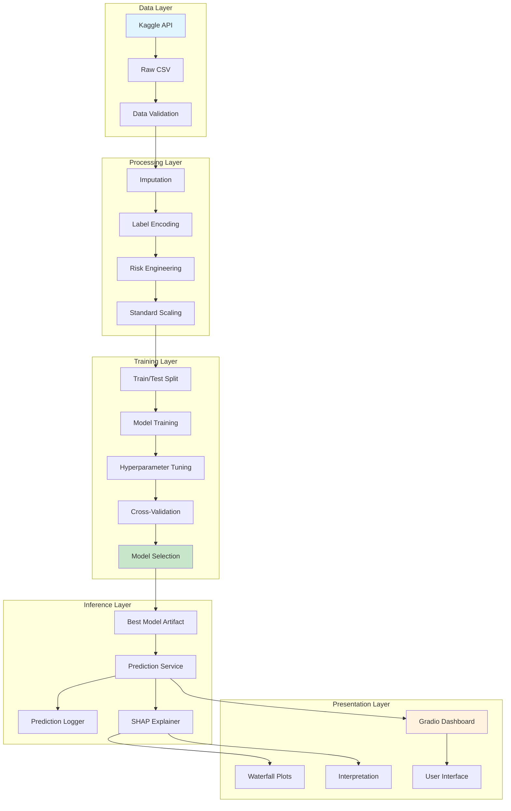
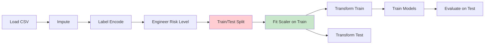
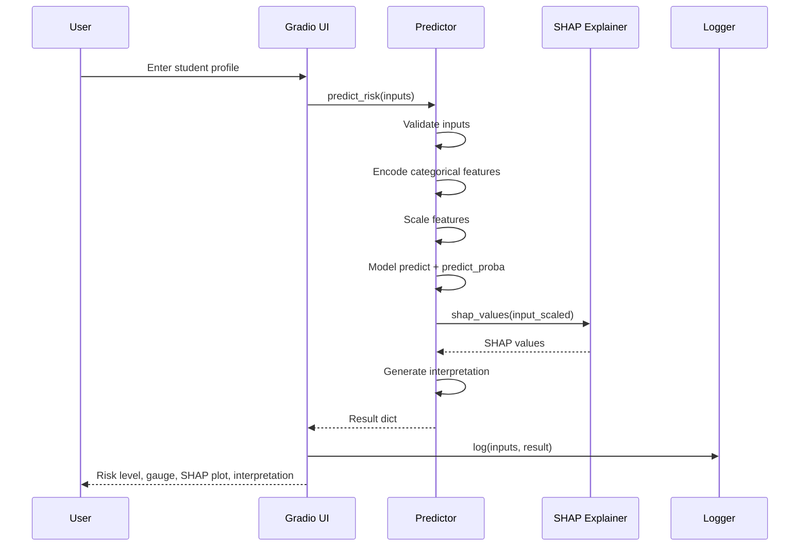
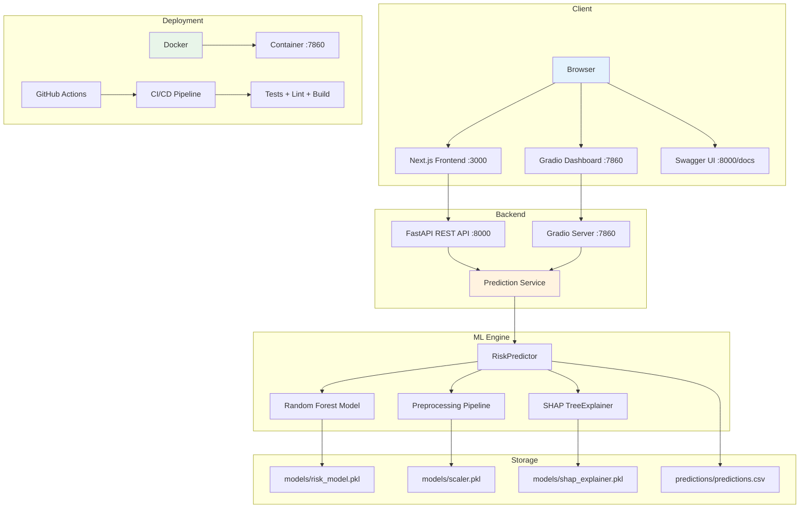
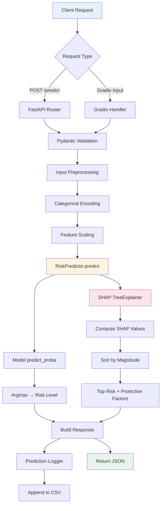

# Architecture

## System Overview

EduRisk AI follows a modular, production-oriented architecture that separates concerns across data, training, inference, and presentation layers.

## High-Level Architecture



## Data Flow (Correct — No Leakage)



**Critical:** Scaler is fit on training data only. Test data is transformed using training statistics.

## Module Responsibilities

| Module | Responsibility | Key Files |
|--------|---------------|-----------|
| `src/config.py` | Central configuration | Paths, hyperparameters, feature lists |
| `src/data/` | Data loading, validation | `dataset.py` |
| `src/preprocessing/` | Cleaning, encoding, scaling | `pipeline.py` |
| `src/features/` | Risk level target engineering | `engineering.py` |
| `src/training/` | Model training and tuning | `models.py`, `tuner.py`, `trainer.py` |
| `src/evaluation/` | Metrics, plots, error analysis | `metrics.py`, `plots.py`, `reporter.py`, `error_analysis.py` |
| `src/explainability/` | SHAP explanations | `shap_utils.py` |
| `src/inference/` | Prediction service and logging | `predictor.py`, `logger.py` |
| `src/utils/` | Shared helpers | `logging.py`, `validators.py` |
| `app/` | Gradio web interface | `main.py` |

## Prediction Flow



## Repository Structure

```
edurisk-ai/
├── app/                    # Gradio application (presentation layer)
│   └── main.py             # App entrypoint, UI layout, prediction function
├── src/                    # Core ML package (business logic)
│   ├── config.py           # Central configuration
│   ├── data/               # Data loading and validation
│   ├── preprocessing/      # Cleaning, encoding, scaling
│   ├── features/           # Feature engineering
│   ├── training/           # Model training and tuning
│   ├── evaluation/         # Metrics, plots, reports, error analysis
│   ├── explainability/     # SHAP utilities
│   ├── inference/          # Prediction service and logging
│   └── utils/              # Shared utilities
├── tests/                  # Unit tests (53 tests)
├── notebooks/              # Jupyter notebooks (exploration)
├── docs/                   # Documentation
├── models/                 # Saved model artifacts (.gitignored)
├── data/                   # Raw and processed data (.gitignored)
└── docker/                 # Containerization
```

## Design Principles

1. **Separation of Concerns**: Each module has a single responsibility
2. **No Data Leakage**: Scaler fits on training data only
3. **Configuration-Driven**: All paths, hyperparameters, and constants in `config.py`
4. **Reproducibility**: Fixed random seeds, deterministic pipelines
5. **Testability**: Each module is independently testable
6. **Graceful Degradation**: SHAP falls back gracefully if computation fails

---

## Deployment Architecture



### Ports

| Service | Port | URL |
|---------|------|-----|
| Next.js Frontend | 3000 | http://localhost:3000 |
| FastAPI REST API | 8000 | http://localhost:8000 |
| Swagger Docs | 8000 | http://localhost:8000/docs |
| Gradio Dashboard | 7860 | http://localhost:7860 |

---

## Inference Flow (Request Lifecycle)



### Response Structure

```json
{
  "prediction": 2,
  "risk_level": "High Risk",
  "confidence": "94.9%",
  "probabilities_raw": {"0": 0.0, "1": 0.05, "2": 0.95},
  "shap": {
    "sorted_features": ["Suicidal Thoughts", "Financial Stress", ...],
    "shap_values": [0.332, 0.117, ...],
    "top_risk": [...],
    "top_protective": [...]
  }
}
```
