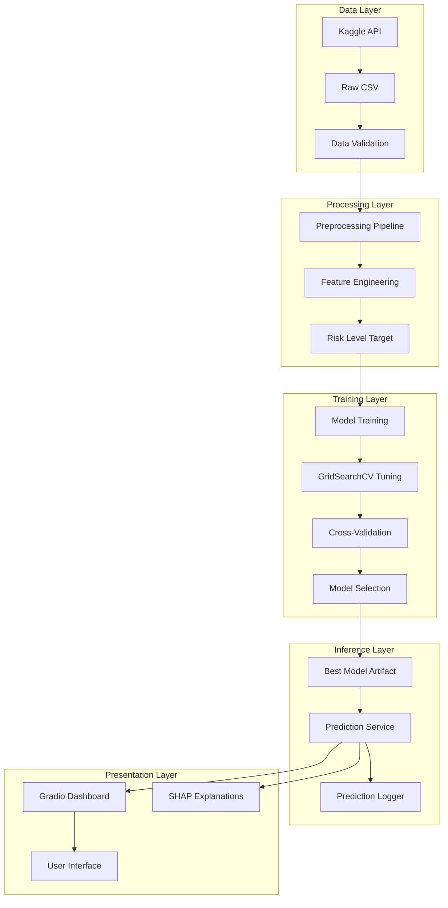

# Architecture

## System Overview

EduRisk AI follows a modular, production-oriented architecture that separates concerns across data, training, inference, and presentation layers.

## Component Diagram

## Module Responsibilities

| Module | Responsibility |
|--------|---------------|
| `src/data/` | Data loading, validation, Kaggle API integration |
| `src/preprocessing/` | Cleaning, encoding, scaling, sklearn Pipeline |
| `src/features/` | Risk level target engineering |
| `src/training/` | Model definitions, hyperparameter tuning, orchestration |
| `src/evaluation/` | Metrics, plots, comparison reports |
| `src/explainability/` | SHAP global and local explanations |
| `src/inference/` | Prediction service and logging |
| `src/utils/` | Shared helpers (logging, validation, I/O) |
| `app/` | Gradio web interface |

## Data Flow

1. **Ingestion**: Kaggle API → Raw CSV → Validation
2. **Processing**: Imputation → Label Encoding → Standard Scaling
3. **Training**: Stratified Split → GridSearchCV → Model Selection
4. **Inference**: User Input → Encoding → Scaling → Prediction → SHAP
5. **Logging**: Timestamped CSV of all predictions
