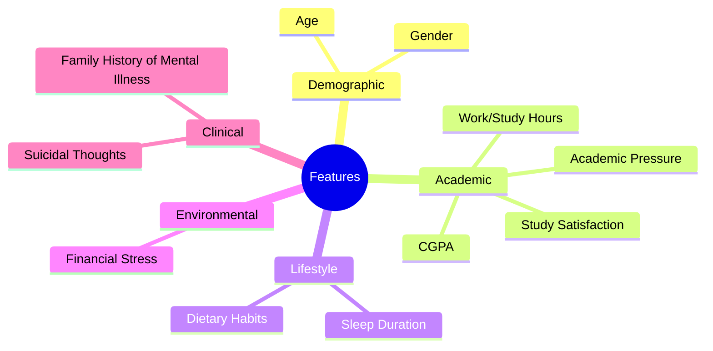
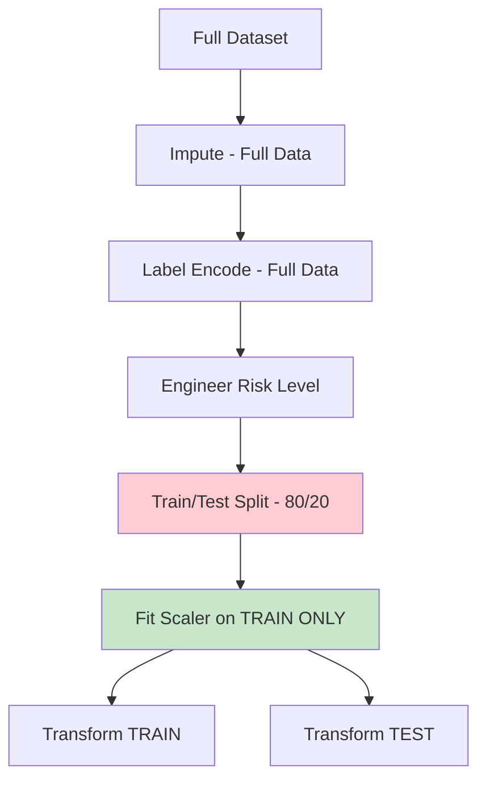

# ML Methodology

## Overview

EduRisk AI uses a supervised multi-class classification approach to predict student academic risk levels. The methodology follows standard ML best practices with emphasis on preventing data leakage and ensuring reproducibility.

## Dataset

**Student Depression Dataset** from Kaggle (~27,000 records, 27 features).

## Feature Selection

11 features were selected based on domain relevance and availability:

| Feature | Type | Reasoning |
|---------|------|-----------|
| Gender | Categorical | Demographic baseline |
| Age | Numerical | Developmental factor |
| Academic Pressure | Ordinal (1-5) | Direct academic indicator |
| CGPA | Numerical | Academic performance |
| Study Satisfaction | Ordinal (1-5) | Engagement indicator |
| Sleep Duration | Categorical | Lifestyle factor |
| Dietary Habits | Categorical | Lifestyle factor |
| Work/Study Hours | Numerical | Time allocation |
| Financial Stress | Ordinal (1-5) | Environmental factor |
| Family History | Categorical | Genetic/environmental risk |
| Suicidal Thoughts | Categorical | Mental health severity |

## Preprocessing Pipeline

### Data Leakage Prevention

The pipeline ensures no information from the test set leaks into training:

### Preprocessing Steps

| Step | Method | Scope |
|------|--------|-------|
| Missing Values (Numerical) | Median | Full data (safe for risk engineering) |
| Missing Values (Categorical) | Mode | Full data (safe for risk engineering) |
| Encoding | LabelEncoder | Full data (deterministic, safe) |
| Scaling | StandardScaler | **Train only** (critical for no leakage) |

## Target Engineering

Composite scoring function combines multiple indicators into a 3-class risk level:

### Risk Factors (Increase Score)

| Factor | Condition | Weight |
|--------|-----------|--------|
| Depression | == 1 | +3 |
| Academic Pressure | >= 4 | +2 |
| Low CGPA | < 2.0 | +2 |
| Financial Stress | >= 4 | +1 |
| Suicidal Thoughts | == 1 | +3 |
| Low Sleep | < 5 hours | +1 |

### Protective Factors (Decrease Score)

| Factor | Condition | Weight |
|--------|-----------|--------|
| High CGPA | >= 3.0 | -2 |
| High Study Satisfaction | >= 4 | -1 |

### Threshold Mapping

| Score Range | Risk Level |
|-------------|------------|
| score ≤ 1 | Low Risk (0) |
| score ≤ 4 | Medium Risk (1) |
| score > 4 | High Risk (2) |

## Models

| Model | Type | Hyperparameters | SHAP Compatible |
|-------|------|-----------------|-----------------|
| Random Forest | Ensemble (bagging) | n_estimators, max_depth, min_samples_split | ✅ TreeExplainer |
| SVM (RBF) | Kernel method | kernel=rbf, probability=True | ⚠️ KernelExplainer |
| XGBoost | Ensemble (boosting) | n_estimators, max_depth, learning_rate | ✅ TreeExplainer |
| MLP | Neural network | (64, 32), early_stopping | ⚠️ KernelExplainer |

### Tuning Strategy

- **Default**: GridSearchCV (deterministic, reproducible)
- **Optional**: Optuna with TPE sampler (Bayesian optimization, deeper search)
- Toggle via `TRAINING.use_optuna` in `src/config.py`

## Evaluation Metrics

| Metric | Description |
|--------|-------------|
| Accuracy | Overall correct predictions |
| ROC-AUC (OvR) | One-vs-Rest area under ROC curve |
| 5-Fold CV | Stratified cross-validation accuracy |
| Precision | Per-class precision |
| Recall | Per-class recall |
| F1-Score | Harmonic mean of precision and recall |
| Confusion Matrix | Error breakdown by class |
| Error Analysis | Misclassification patterns |

## Explainability

### Global Explanations
- **SHAP Summary Bar**: Feature importance ranking
- **SHAP Beeswarm**: Feature importance with value distribution
- **SHAP Dependence**: Individual feature effects

### Local Explanations
- **Waterfall Plot**: Per-prediction feature contributions
- **Probability Donut**: Class probability visualization
- **Human-Readable Interpretation**: Natural language explanation
- **Risk/Protective Factors**: Top factors increasing/decreasing risk
