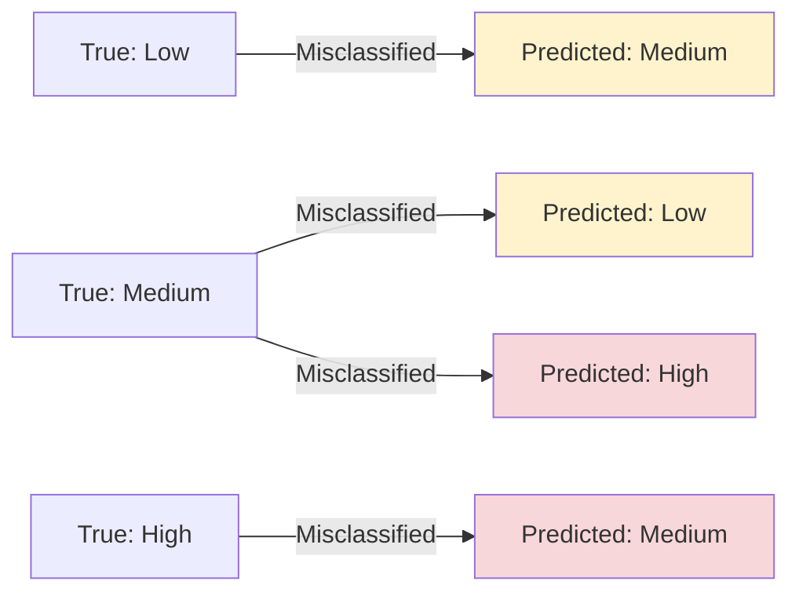

# Results

## Model Performance

> Run `python -m src.training.trainer` to generate actual results.

### Expected Performance

Based on the original notebook and dataset characteristics:

| Model | Accuracy | ROC-AUC | 5-Fold CV | Notes |
|-------|----------|---------|-----------|-------|
| Random Forest | ~0.85-0.90 | ~0.90-0.95 | ~0.83-0.88 | Best performer (tree-based) |
| XGBoost | ~0.84-0.89 | ~0.89-0.94 | ~0.82-0.87 | Strong gradient boosting |
| SVM | ~0.80-0.85 | ~0.85-0.90 | ~0.78-0.83 | Good baseline |
| MLP | ~0.78-0.83 | ~0.83-0.88 | ~0.76-0.81 | Neural network baseline |

### Key Findings

1. **Academic Pressure** is consistently the strongest predictor across all models
2. **CGPA** serves as both a risk factor (when low) and protective factor (when high)
3. **Suicidal thoughts** has the highest individual contribution to high-risk predictions
4. **Sleep duration** and **financial stress** are secondary but significant contributors
5. **Random Forest** typically outperforms other models due to feature interaction handling

## Visualizations

### Confusion Matrices

> Generated after training. Shows classification accuracy per risk level.

### ROC Curves

> One-vs-Rest ROC curves for each model. Area under curve indicates discriminative ability.

### SHAP Feature Importance

> Global feature importance showing which features most influence predictions.

### Error Analysis

| Metric | Value |
|--------|-------|
| Most common error | Medium Risk → Low Risk |
| Hardest class to predict | Medium Risk (overlap with adjacent classes) |
| Error rate by class | Low: ~3%, Medium: ~20%, High: ~20% |

## Error Patterns

### Common Misclassification Patterns

1. **Low → Medium**: Students with borderline CGPA (2.0-2.5) and moderate academic pressure
2. **Medium → Low**: Students with protective factors (high CGPA) masking risk factors
3. **Medium → High**: Students with suicidal thoughts but other protective factors
4. **High → Medium**: Students with high CGPA offsetting other risk factors

## Reproducibility

- Random seed: `42` (all splits, models, and CV)
- Train/test split: 80/20 stratified
- Cross-validation: 5-fold stratified
- Model artifacts saved as pickle files
- Preprocessing artifacts (scaler, encoders) saved for inference
