# Results

## Dataset Summary

| Metric | Value |
|--------|-------|
| Total samples | 27,901 |
| Features | 11 (after selection) |
| Train/Test split | 22,320 / 5,581 (80/20 stratified) |
| Target classes | 3 (Low Risk, Medium Risk, High Risk) |
| Class balance | Low: 37.5%, Medium: 21.8%, High: 40.7% |
| Missing values | 3 (Financial Stress only) |

## Model Performance

| Model | Accuracy | ROC-AUC | 3-Fold CV | CV Std |
|-------|----------|---------|-----------|--------|
| **Random Forest** | **0.8558** | **0.9492** | 0.8527 | 0.0039 |
| XGBoost | 0.8524 | 0.9502 | 0.8588 | 0.0027 |
| MLP | 0.8518 | 0.9469 | 0.8466 | 0.0046 |
| SVM | 0.8212 | 0.9310 | 0.8240 | 0.0019 |

**Best Model:** Random Forest (Accuracy: 85.58%, ROC-AUC: 94.92%)

### Per-Class Classification Report (Best Model — Random Forest)

| Class | Precision | Recall | F1-Score | Support |
|-------|-----------|--------|----------|---------|
| Low Risk | 0.87 | 0.88 | 0.88 | 2,090 |
| Medium Risk | 0.70 | 0.59 | 0.64 | 1,219 |
| High Risk | 0.91 | 0.97 | 0.94 | 2,272 |
| **Weighted Avg** | **0.85** | **0.86** | **0.85** | **5,581** |

### Tuned Hyperparameters

| Model | Best Parameters |
|-------|----------------|
| Random Forest | `max_depth=15, min_samples_split=5, n_estimators=100` |
| XGBoost | `learning_rate=0.1, max_depth=4, n_estimators=200` |
| SVM | Default (RBF kernel, probability=True) |
| MLP | Default (64, 32) hidden layers, early stopping |

## Error Analysis

### Error Rate by Class (Random Forest)

| Class | Total | Errors | Error Rate |
|-------|-------|--------|------------|
| Low Risk | 2,090 | 249 | 11.9% |
| Medium Risk | 1,219 | 498 | 40.9% |
| High Risk | 2,272 | 58 | 2.6% |

### Top Confusion Pairs

1. **Medium Risk → Low Risk**: 274 times (borderline cases with protective factors)
2. **Low Risk → Medium Risk**: 249 times (students with some risk indicators)
3. **Medium Risk → High Risk**: 224 times (missing suicidal thoughts signal)
4. **High Risk → Medium Risk**: 57 times (high CGPA offsetting risk factors)

### Key Findings

1. **Medium Risk** is the hardest class to predict (40.9% error rate) due to overlap with adjacent classes
2. **High Risk** is the easiest to predict (2.6% error rate) — clear signal from suicidal thoughts + academic pressure
3. **Academic Pressure** is consistently the strongest predictor across all models
4. **CGPA** serves as both a risk factor (when low) and protective factor (when high)
5. **Suicidal thoughts** has the highest individual contribution to high-risk predictions

## Visualizations

### Confusion Matrices

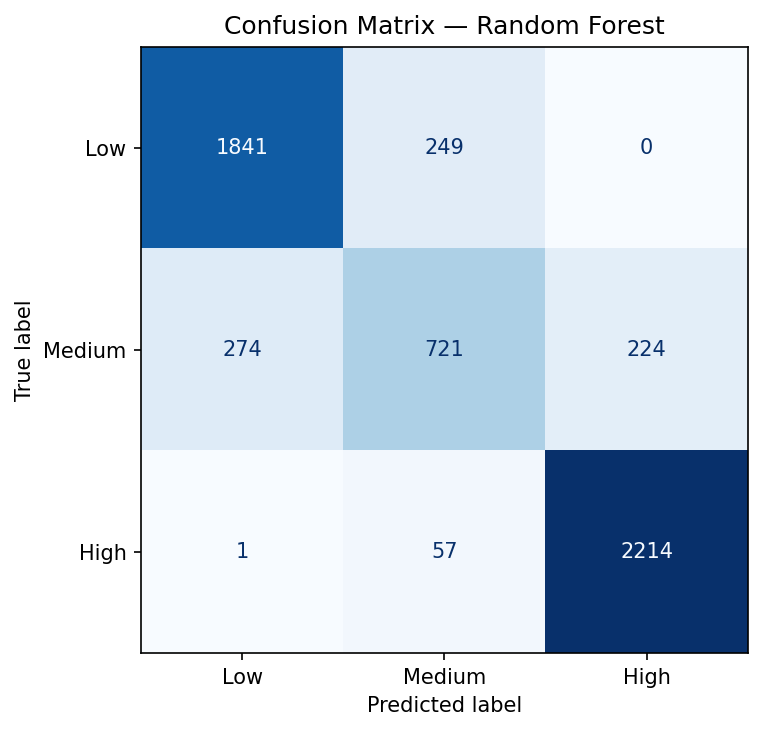
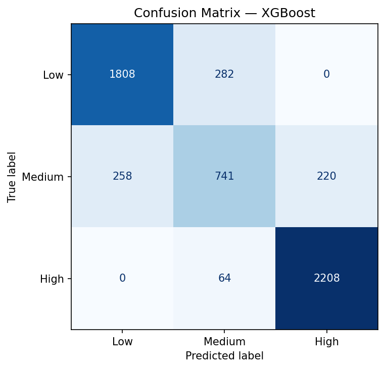
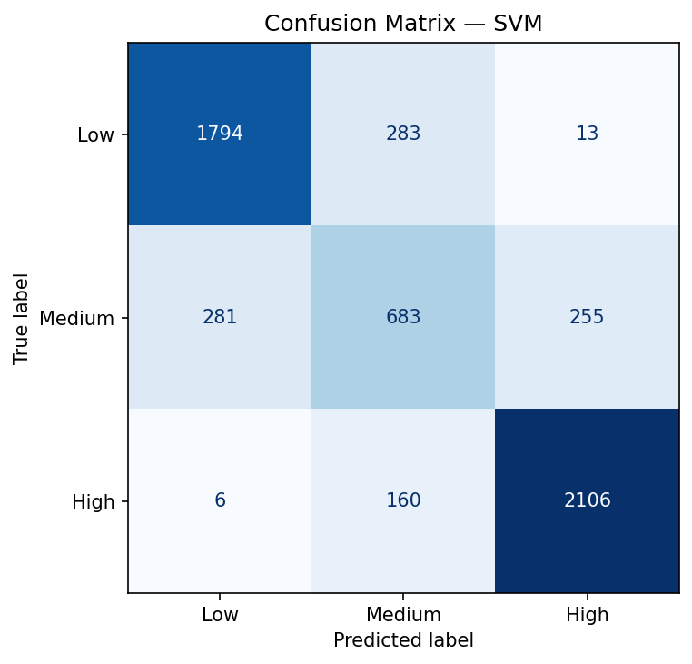

### ROC Curves

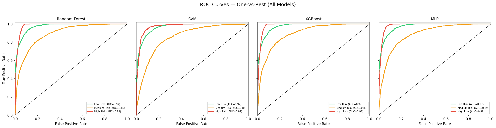

### Precision-Recall Curves

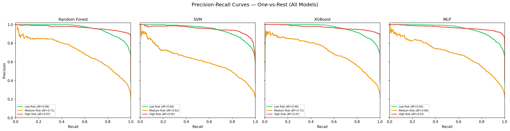

### Calibration Curves

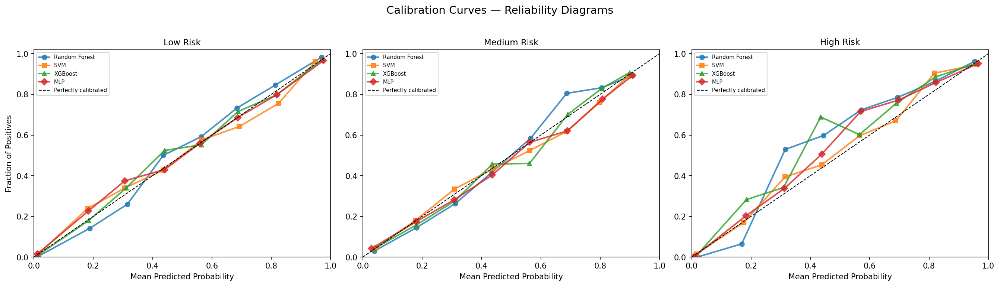

### Learning Curves

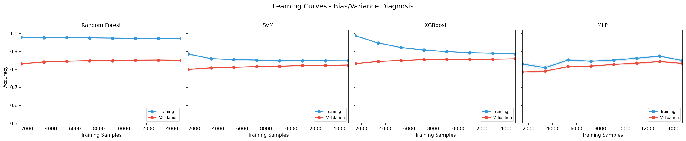

### Model Comparison

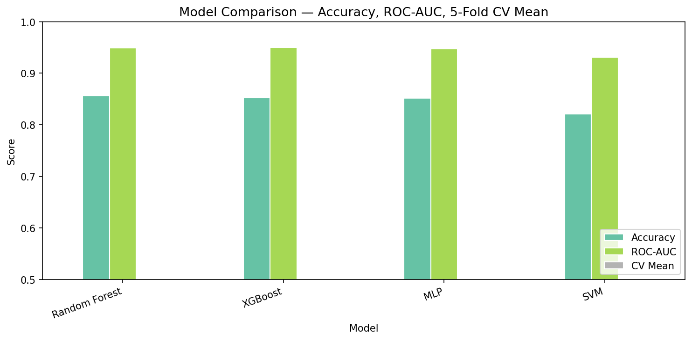
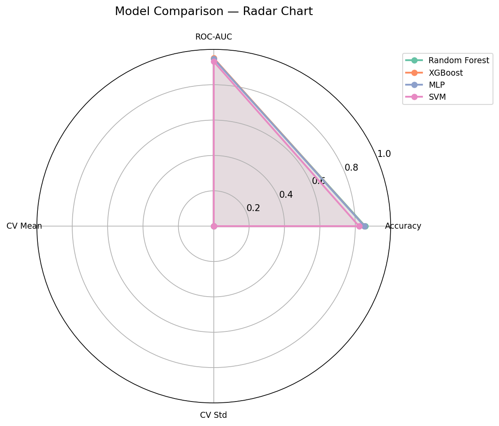

### SHAP Feature Importance

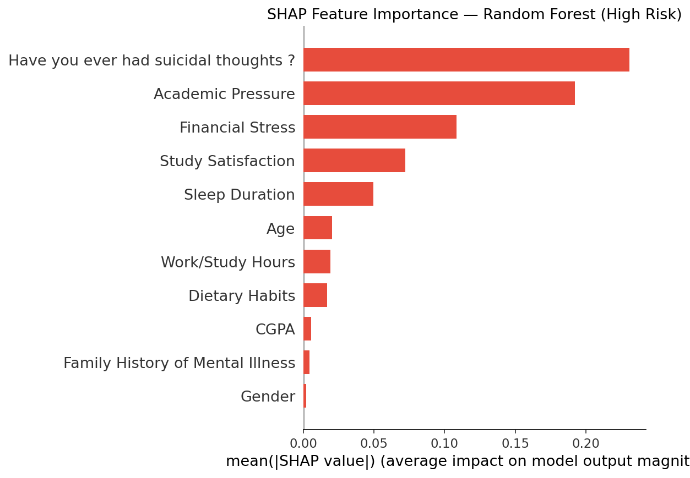
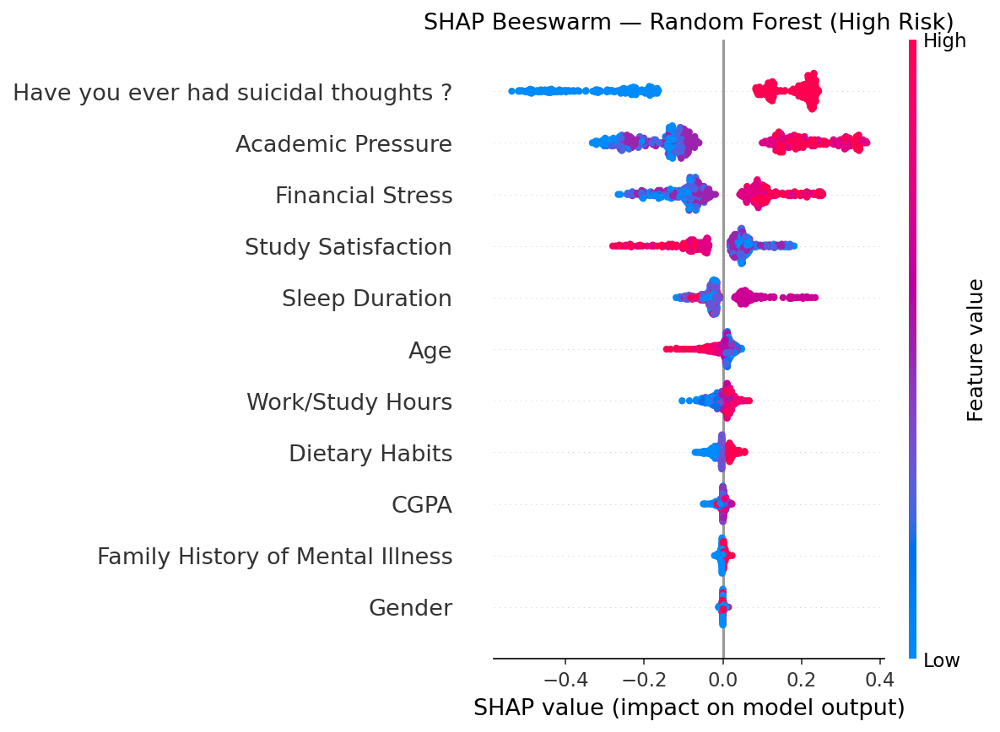

### Class Distribution

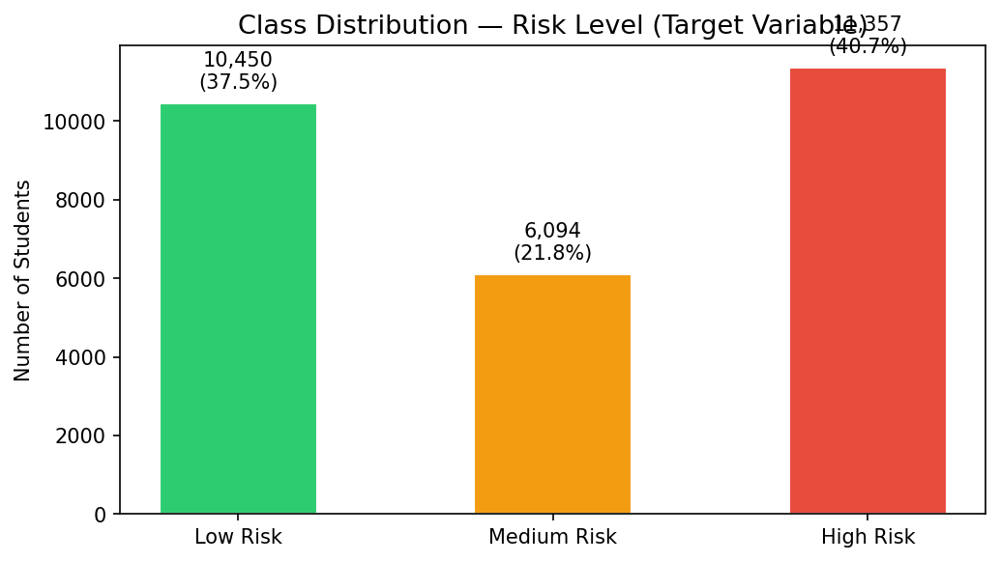

## Error Patterns

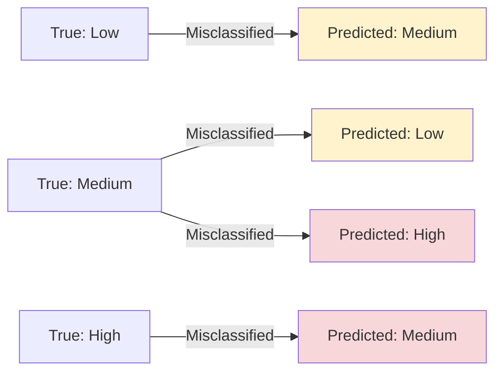

### Common Misclassification Patterns

1. **Low → Medium**: Students with borderline CGPA (2.0-2.5) and moderate academic pressure
2. **Medium → Low**: Students with protective factors (high CGPA) masking risk factors
3. **Medium → High**: Students with suicidal thoughts but other protective factors
4. **High → Medium**: Students with high CGPA offsetting other risk factors

## Reproducibility

- **Random seed:** `42` (all splits, models, and CV)
- **Train/test split:** 80/20 stratified
- **Cross-validation:** 3-fold stratified
- **Scaler:** StandardScaler fit on training data only (no leakage)
- **Encoders:** LabelEncoder fit on full data (deterministic, safe for risk engineering)
- **Model artifacts:** Saved as pickle files in `models/`
- **Figures:** Saved to `assets/results/` (13 PNG files)
